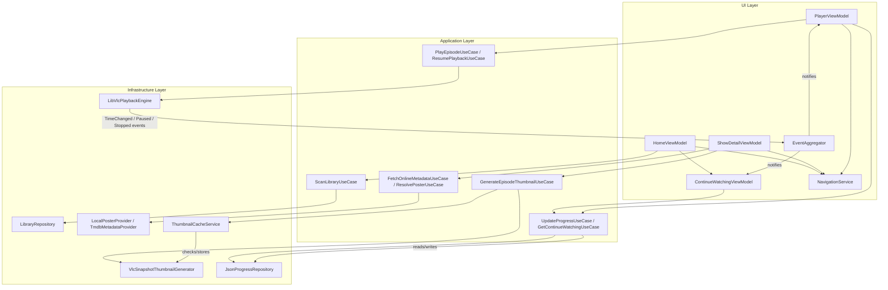

# Implementation Completion Document — Local Netflix-Style Media Player

This document consolidates and completes the remaining implementation documentation for the WPF + LibVLCSharp media player, building on the existing planning document, UI layout specification, JSON progress schema, folder structure, and class list.

---

## 1. Refined Class List

The original class list is largely complete and consistent with the clean-architecture folder structure. Below is the refined list, with additions (marked **NEW**) needed for a production-ready implementation: custom exceptions, configuration, startup orchestration, event aggregation, and thumbnail caching.

### MediaPlayerApp.Domain

**Entities**
- **Show** — Represents a show with its name, folder path, and collection of seasons.
- **Season** — Represents a season number and its collection of episodes.
- **Episode** — Represents a single episode's file path, number, title, and metadata.
- **WatchProgress** — Represents an episode's playback position, duration, and watch status.

**Value Objects**
- **EpisodeKey** — Stable identifier derived from show, season, and episode number.
- **SeasonEpisodeNumber** — Represents a parsed season/episode number pair.
- **PlaybackPosition** — Represents a playback position/duration pair with helper comparisons.

**Enums**
- **WatchStatus** — Enumerates NotStarted, InProgress, and Completed states.

**Abstractions**
- **ILibraryRepository** — Contract for retrieving the scanned show/season/episode library.
- **IProgressRepository** — Contract for loading and saving watch progress data.
- **IMetadataProvider** — Contract for resolving posters and show/episode metadata.
- **IThumbnailGenerator** — Contract for generating episode thumbnail images.
- **IMediaPlaybackEngine** — Contract for controlling media playback.
- **IThumbnailCache** *(NEW)* — Contract for checking, storing, and retrieving cached thumbnails.
- **IAppConfiguration** *(NEW)* — Contract exposing validated application configuration values.

**Exceptions** *(NEW)*
- **LibraryScanException** — Raised when the Videos root folder cannot be scanned or is invalid.
- **MediaPlaybackException** — Raised when LibVLCSharp fails to load or play a media file.
- **ProgressPersistenceException** — Raised when the progress JSON file cannot be read or written.
- **MetadataRetrievalException** — Raised when an online/local metadata lookup fails unexpectedly.
- **ThumbnailGenerationException** — Raised when a thumbnail snapshot cannot be produced.

### MediaPlayerApp.Application

**Library Scanning**
- **ScanLibraryUseCase** — Orchestrates scanning the root Videos folder into a show/season/episode library.
- **FileNameParsingService** — Extracts show name, season, and episode numbers from folder and file names.

**Metadata**
- **ResolvePosterUseCase** — Determines the poster image to use for a show or season.
- **FetchOnlineMetadataUseCase** — Retrieves and caches metadata from an online provider when needed.

**Thumbnails**
- **GenerateEpisodeThumbnailUseCase** — Coordinates generating and caching a thumbnail for an episode.

**Playback**
- **PlayEpisodeUseCase** — Starts playback of a selected episode.
- **ResumePlaybackUseCase** — Resumes playback of an episode from its stored progress position.

**Progress**
- **UpdateProgressUseCase** — Updates and persists an episode's watch progress.
- **GetContinueWatchingUseCase** — Builds the ordered Continue Watching list from stored progress.

**DTOs**
- **ShowSummaryDto** — Lightweight show data shape for UI binding.
- **EpisodeSummaryDto** — Lightweight episode data shape for UI binding.
- **ContinueWatchingItemDto** — Lightweight data shape representing a Continue Watching entry.

**Cross-Cutting Interfaces** *(NEW)*
- **INavigationService** — Contract for navigating between application screens.
- **IEventAggregator** — Contract for publishing/subscribing to cross-viewmodel notifications (e.g., progress updated, playback state changed).

### MediaPlayerApp.Infrastructure

**File System**
- **LibraryRepository** — Scans the filesystem and builds the show/season/episode library.
- **VideoFileExtensions** — Identifies supported video file extensions.
- **FolderNameCleaner** — Cleans raw folder/file names into display-friendly titles.

**Playback**
- **LibVlcPlaybackEngine** — Wraps LibVLCSharp to provide play, pause, stop, and seek behavior.
- **LibVlcInitializer** — Initializes and holds the shared LibVLC engine instance.

**Thumbnails**
- **VlcSnapshotThumbnailGenerator** — Generates episode thumbnails using LibVLCSharp frame snapshots.
- **ThumbnailCacheService** *(NEW)* — Implements `IThumbnailCache`; checks disk cache, triggers generation, and returns thumbnail paths.

**Metadata**
- **LocalPosterProvider** — Resolves poster images from local show/season folders.
- **TmdbMetadataProvider** — Fetches show and episode metadata from TMDB.
- **MetadataCacheStore** — Caches downloaded metadata and assets on disk.

**Persistence**
- **JsonProgressRepository** — Reads and writes playback progress to a JSON file.
- **AtomicFileWriter** — Writes files safely using a temp-file-then-rename pattern.

**Configuration** *(NEW)*
- **AppPaths** — Resolves application data, cache, and thumbnail folder paths.
- **AppConfigurationService** — Implements `IAppConfiguration`; loads, validates, and exposes settings such as the Videos root path.

### MediaPlayerApp.UI

**Views**
- **MainWindow** — Hosts the application shell and navigation frame.
- **HomeView** — Displays the Continue Watching row and the main shows grid.
- **ContinueWatchingRowView** — Displays the horizontally scrolling Continue Watching row.
- **ShowDetailView** — Displays a show's poster, season selector, and episode list.
- **PlayerView** — Displays the video surface and playback controls.

**ViewModels**
- **MainWindowViewModel** — Manages shell-level state and navigation.
- **HomeViewModel** — Provides the shows grid data for the Home screen.
- **ContinueWatchingViewModel** — Provides the Continue Watching items for display.
- **ShowDetailViewModel** — Provides season and episode data for the Show Detail screen.
- **PlayerViewModel** — Manages playback state and controls for the Player screen.

**Controls**
- **MediaCardControl** — Reusable card displaying a poster/thumbnail, title, and progress bar.
- **PlaybackControlsBar** — Reusable playback transport controls bar.

**Navigation**
- **NavigationService** — Implements `INavigationService`; handles navigation between application screens.

**Startup** *(NEW)*
- **AppBootstrapper** — Coordinates application startup sequence (LibVLC init, folder validation, cache/progress loading, navigation setup).
- **CompositionRoot** — Registers all services, repositories, and use cases with the dependency injection container.

**Error Presentation** *(NEW)*
- **ErrorNotificationViewModel** — Holds and exposes the current user-facing error/notification banner state.

### MediaPlayerApp.Common

- **ILogger** — Defines a simple logging abstraction used across layers.
- **EventAggregator** *(NEW)* — Implements `IEventAggregator`; provides simple publish/subscribe messaging across viewmodels.
- **DebounceHelper** — Provides debounced execution for frequent events such as progress updates.
- **StringExtensions** — Provides shared string helper methods such as folder-name cleanup.

---

## 2. Component Interaction Diagram



**Key interactions:**
- ViewModels never talk to Infrastructure directly — all calls flow through Application use cases.
- `EventAggregator` decouples the `PlaybackEngine`'s low-level events from interested ViewModels (e.g., updating a Continue Watching progress bar while the Player screen is active).
- `NavigationService` is invoked by any ViewModel needing to transition screens, keeping navigation logic out of Views' code-behind.

---

## 3. Data Flow Diagram

```mermaid
flowchart LR
    subgraph FileSystem
        VideosFolder[(Root Videos Folder)]
        PosterFiles[(Local Poster Images)]
    end

    subgraph Domain
        LibraryModel[Show / Season / Episode Entities]
    end

    subgraph UI
        HomeGrid[Home Grid / Show Detail / Episode List]
        Player[Player View]
    end

    subgraph Metadata
        LocalMeta[LocalPosterProvider]
        OnlineMeta[TmdbMetadataProvider]
        MetaCache[(metadata-cache.json + cached images)]
    end

    subgraph Progress
        PlaybackEngine[LibVlcPlaybackEngine]
        ProgressTracker[UpdateProgressUseCase]
        ProgressJson[(progress.json)]
    end

    VideosFolder -->|scan + parse| LibraryModel
    LibraryModel -->|DTOs| HomeGrid

    PosterFiles --> LocalMeta
    LocalMeta -->|fallback if missing| OnlineMeta
    OnlineMeta --> MetaCache
    LocalMeta --> MetaCache
    MetaCache -->|poster/backdrop paths| HomeGrid

    HomeGrid -->|select episode| Player
    Player --> PlaybackEngine
    PlaybackEngine -->|position/duration events| ProgressTracker
    ProgressTracker -->|debounced/immediate writes| ProgressJson
    ProgressJson -->|load on startup| ProgressTracker
    ProgressTracker -->|Continue Watching list| HomeGrid
```



**Summary:**
1. **File system ? Domain ? UI**: the scanner reads folders/files, builds domain entities, which are projected into DTOs consumed by the UI grids.
2. **Playback engine ? Progress tracker ? JSON**: playback events update in-memory progress, which is debounced/flushed to `progress.json`.
3. **Metadata provider ? Cache ? UI**: local posters are preferred; TMDB is a fallback, with all results cached to disk and read directly by the UI thereafter.

---

## 4. Error Handling Strategy

### Custom Exception Types
- **LibraryScanException** — Invalid/missing root folder, permission errors, or unreadable directory structure.
- **MediaPlaybackException** — LibVLC failed to open/play a file (corrupt file, unsupported codec, missing path).
- **ProgressPersistenceException** — `progress.json` unreadable, corrupt, or unwritable (disk full, permission denied).
- **MetadataRetrievalException** — Online metadata lookup failed (network timeout, API error, no match found).
- **ThumbnailGenerationException** — Snapshot generation failed for a given episode.

All custom exceptions derive from a common `MediaPlayerAppException` base type so calling code can catch broadly when needed, or catch specific types for targeted handling.

### Propagation Through Layers
- **Infrastructure** catches low-level exceptions (`IOException`, `HttpRequestException`, LibVLC native errors) and rethrows them wrapped as the appropriate domain-specific custom exception, preserving the original as `InnerException`.
- **Application (use cases)** does not swallow exceptions; it lets domain-specific exceptions propagate upward, optionally enriching them with use-case context, but may catch and translate exceptions into a "result" outcome (success/failure) object for predictable ViewModel consumption.
- **UI (ViewModels)** is the final boundary: it catches exceptions from use case calls, logs them, and translates them into a **user-facing error state** rather than allowing unhandled exceptions to crash the app.
- A global unhandled-exception handler (`DispatcherUnhandledException` at the App level) acts as a last-resort safety net, logging the error and showing a generic recoverable error message instead of a hard crash where possible.

### Surfacing Errors in the UI
- Non-fatal errors (e.g., a single episode failed to generate a thumbnail, one show's metadata lookup failed) should **degrade gracefully**: show a placeholder image/skip the affected item, without interrupting the rest of the library.
- Fatal/blocking errors (e.g., the Videos root folder is invalid, `progress.json` cannot be loaded at all) surface via a dismissible **banner/toast notification** (backed by `ErrorNotificationViewModel`) at the top of the current screen, with a short human-readable message and an optional "Retry" action.
- Playback errors surface inline within the Player screen (e.g., "This video could not be played" message replacing the video surface), with a button to return to Show Detail.
- Raw exception details/stack traces are never shown directly to the user; they are logged instead, with only a simplified message and optional "View details" expander for advanced users/support purposes.

---

## 5. Logging Strategy

### Log Levels
- **Trace** — Very fine-grained diagnostic detail (e.g., raw filenames being parsed), disabled by default.
- **Debug** — Developer-oriented detail useful during development (e.g., cache hit/miss decisions).
- **Information** — Normal operational events (e.g., "Library scan completed: 42 shows found", "Progress saved").
- **Warning** — Recoverable issues that don't stop the app (e.g., "Thumbnail generation failed for episode X, using placeholder").
- **Error** — Failures that affected a specific operation but the app continues running (e.g., "Failed to fetch metadata for show Y").
- **Critical** — Failures that prevent core functionality or crash a screen/app (e.g., "Videos root folder inaccessible at startup").

### What Gets Logged Per Layer
- **Infrastructure**: file system scan results/failures, LibVLC initialization and playback engine errors, HTTP request/response summaries for metadata calls, JSON read/write successes and failures.
- **Application (use cases)**: high-level operation start/end (e.g., "ScanLibraryUseCase started/completed"), use-case-level failures with contextual identifiers (show/episode key involved).
- **UI**: navigation events (screen transitions), user-triggered actions of note (e.g., "User resumed episode X"), and any exception caught at the ViewModel boundary before being surfaced to the user.
- Sensitive data (full user file paths can be logged, as this is a local desktop app with no multi-user privacy concern) is otherwise not a major restriction here, but any future online-account credentials, if added, must never be logged.

### Log Storage
- Logs are written to a rolling **local log file** under the app's data folder (e.g., `data/logs/app-YYYYMMDD.log`), with a retention policy (e.g., keep the last 7–14 days) to prevent unbounded growth.
- Optionally mirror `Warning` and above to the **Debug Output/Console** during development builds only.
- The `ILogger` abstraction in `MediaPlayerApp.Common` decouples the rest of the app from the concrete logging implementation (e.g., a simple file-based logger initially, swappable later for a more feature-rich library without touching call sites).

---

## 6. Configuration Service Design

### Loading and Validation
- On startup, `AppConfigurationService` (implementing `IAppConfiguration`) loads a configuration file (e.g., `config.json` in the app's data folder) if present, or creates one with sensible defaults on first run.
- Validation performed at load time:
  - Confirms the configured **Videos root path** exists and is readable; if missing/invalid, the UI must prompt the user to select a valid folder rather than proceeding silently.
  - Confirms numeric/boolean fields are within sane ranges (e.g., thumbnail timestamp offset is non-negative).
  - Falls back to default values for any missing/invalid individual field rather than rejecting the entire configuration file.
- Configuration is exposed as a read-only snapshot (`IAppConfiguration`) to the rest of the app; changes made via a future Settings screen go through a dedicated update/save path that revalidates before persisting.

### Recommended Configuration Fields
| Field | Type | Purpose |
|---|---|---|
| `videosRootPath` | string | Root folder to scan for shows/seasons/episodes. |
| `enableOnlineMetadata` | boolean | Whether TMDB (or similar) lookups are permitted. |
| `tmdbApiKey` | string (optional) | API key for the online metadata provider, if used. |
| `thumbnailTimestampSeconds` | integer | Offset into each video used for thumbnail snapshot generation. |
| `continueWatchingMaxItems` | integer | Maximum number of entries retained in the Continue Watching list. |
| `completionThresholdPercent` | number | Percentage of duration watched at which an episode is marked Completed. |
| `progressSaveDebounceSeconds` | integer | Minimum interval between debounced progress writes during playback. |
| `logRetentionDays` | integer | Number of days of log files to retain before cleanup. |
| `theme` | string | UI theme selection (e.g., "Dark"), reserved for future use. |

---

## 7. Startup / Bootstrapper Design

`AppBootstrapper`, invoked from `App.xaml.cs` (composition root), performs the following ordered steps before the Home screen is shown:

1. **Logging initialization** — Set up the `ILogger` implementation first, so all subsequent steps can log.
2. **Configuration loading** — `AppConfigurationService` loads/validates `config.json`; if the Videos root path is missing/invalid, show a folder-picker prompt before continuing.
3. **LibVLC initialization** — `LibVlcInitializer` initializes the native LibVLC engine once and constructs the shared `LibVLC` instance used by all playback and thumbnail-generation components.
4. **Folder validation** — Confirm the configured Videos root path still exists and is accessible; surface a blocking error dialog with a retry/choose-folder option if not.
5. **Progress loading** — `JsonProgressRepository` loads `progress.json` into memory (or initializes an empty store on first run / corrupt file recovery).
6. **Metadata cache loading** — `MetadataCacheStore` loads `metadata-cache.json` so cached posters/descriptions are available immediately without waiting on network calls.
7. **Library scan** — `ScanLibraryUseCase` performs the initial recursive scan of the Videos root folder, populating the in-memory library model (this may run asynchronously with a loading indicator shown in the UI).
8. **Thumbnail cache warm-up** — Kick off background thumbnail generation (via `ThumbnailCacheService`) for episodes missing cached thumbnails, without blocking the UI from displaying already-cached results.
9. **Navigation setup** — `NavigationService` is initialized with the Home screen as the initial destination, and `MainWindow` is shown.

Each step logs its start/success/failure at `Information`/`Error` level respectively, and any step failure that is non-fatal (e.g., metadata cache missing) allows startup to continue with degraded functionality, while fatal failures (e.g., LibVLC failed to initialize) show a blocking startup error dialog.

---

## 8. Thumbnail Cache Service Design

`ThumbnailCacheService` (implementing `IThumbnailCache`) mediates between the UI/use cases and the underlying `VlcSnapshotThumbnailGenerator`, ensuring thumbnails are generated at most once per unchanged video file.

### Workflow
1. **Check**: Given an `EpisodeKey`/file path, compute the expected cache file path (e.g., `data/thumbnails/{episodeKey}.jpg`) and check whether it already exists.
2. **Validate freshness**: If the cached file exists, compare the video file's last-modified timestamp against a stored metadata record (or the thumbnail file's own timestamp); if the source is newer, treat the cache as stale.
3. **Generate (on cache miss or stale cache)**: Delegate to `VlcSnapshotThumbnailGenerator`, which seeks to the configured timestamp offset and captures a snapshot using a headless `MediaPlayer` instance.
4. **Store**: Save the generated image to the cache folder using the deterministic `episodeKey`-based filename, via `AtomicFileWriter` to avoid partial/corrupt image files.
5. **Retrieve**: Return the resolved thumbnail file path to the caller (Application use case ? ViewModel ? `MediaCardControl`); if generation fails, return a well-known placeholder image path instead and log a `Warning`.
6. **Background processing**: Thumbnail generation for the full library runs on a background queue/worker after startup, processing a limited number of concurrent generations at a time to avoid overloading disk/CPU, with already-cached items served instantly and in-progress items showing a placeholder until ready.

---

## 9. Dependency Injection Plan

### Registration by Layer
- **Domain**: no registrations needed (contains only entities, value objects, and interfaces).
- **Application (use cases)**: registered as **transient** — each use case is stateless and cheap to construct, invoked per operation.
- **Infrastructure repositories/providers** (`LibraryRepository`, `JsonProgressRepository`, `TmdbMetadataProvider`, `LocalPosterProvider`, `ThumbnailCacheService`): registered as **singleton**, since they wrap shared resources (file paths, HTTP clients, in-memory caches) that should persist for the app's lifetime.
- **LibVlcInitializer / shared `LibVLC` instance**: registered as **singleton** — must be created once and shared across all playback/thumbnail components.
- **LibVlcPlaybackEngine**: registered as **scoped-per-player-session** conceptually; in practice, since WPF has no built-in "scope," a **transient or per-PlayerViewModel-instantiated** `MediaPlayer` wrapper is created fresh each time the Player screen is opened, and disposed on navigation away.
- **AppConfigurationService**: registered as **singleton**, loaded once at startup and shared read-only thereafter.
- **NavigationService, EventAggregator, ILogger**: registered as **singleton**, since they coordinate cross-cutting, app-wide concerns.
- **ViewModels**: registered as **transient** (a new instance per navigation to that screen) except `MainWindowViewModel`, which is **singleton** since it represents the single app shell.

### Summary Table
| Component Type | Lifetime | Rationale |
|---|---|---|
| Use cases | Transient | Stateless, cheap, invoked per operation. |
| Repositories/Providers/Caches | Singleton | Wrap shared file/network/cache resources. |
| LibVLC engine instance | Singleton | Must be initialized exactly once. |
| Playback engine (per-episode) | Transient (per Player session) | Bound to the lifetime of one playback session. |
| Configuration service | Singleton | Loaded once, read-only afterward. |
| Navigation / EventAggregator / Logger | Singleton | App-wide coordination services. |
| ViewModels (feature screens) | Transient | Fresh state per navigation. |
| MainWindowViewModel | Singleton | Represents the single application shell. |

---

## 10. Naming Conventions

- **Classes**: PascalCase, suffixed by role where applicable — `*UseCase` (Application), `*Repository`/`*Provider`/`*Service`/`*Engine` (Infrastructure), `*ViewModel`/`*View`/`*Control` (UI), `*Exception` (custom exceptions).
- **Methods**: PascalCase, verb-first, describing the action performed (e.g., `ScanLibrary`, `GenerateThumbnail`, `SaveProgress`); async methods suffixed with `Async`.
- **ViewModels**: named after the screen/component they back, always suffixed `ViewModel` (e.g., `HomeViewModel`, `ContinueWatchingViewModel`), matching the View name exactly minus the `View`/`ViewModel` suffix pairing (`HomeView` ? `HomeViewModel`).
- **Folders**: PascalCase, grouped by feature under `Views`/`ViewModels` (e.g., `Views/Home/`, `ViewModels/Home/`), and by concern under Infrastructure (e.g., `Infrastructure/Metadata/`, `Infrastructure/Playback/`).
- **JSON fields**: camelCase for all keys (e.g., `showName`, `positionTicks`, `lastWatchedUtc`), consistent with the existing `progress.json` schema; boolean-like status is represented via the `status` string enum rather than ad-hoc boolean flags.

---

## 11. Core Workflow Pseudo-Code

### App Startup
```
start application
  initialize logger
  load and validate configuration
    if videosRootPath invalid -> prompt user to select folder
  initialize LibVLC engine (singleton)
  validate videos root folder still accessible
    if not accessible -> show blocking error, allow retry
  load progress.json into ProgressRepository
  load metadata-cache.json into MetadataCacheStore
  begin ScanLibraryUseCase asynchronously
    on complete -> populate HomeViewModel's shows collection
  begin background thumbnail cache warm-up
  initialize NavigationService with Home as start screen
  show MainWindow
```

### Library Scanning
```
ScanLibraryUseCase.Execute(videosRootPath):
  for each top-level folder in videosRootPath:
    showName = FolderNameCleaner.Clean(folder.Name)
    create Show(showName, folder.Path)
    for each subfolder in folder (season folders) or the folder itself if no subfolders:
      seasonNumber = FileNameParsingService.ParseSeason(subfolder.Name) or default(1)
      create Season(seasonNumber)
      for each video file in subfolder matching known extensions:
        (season, episode) = FileNameParsingService.ParseSeasonEpisode(file.Name)
        if parse fails -> log warning, add to "unrecognized" list, continue
        create Episode(episode, file.Path, parsedTitle)
        add Episode to Season
      add Season to Show
    add Show to Library
  return Library
```

### Episode Playback
```
PlayEpisodeUseCase.Execute(episodeKey):
  episode = LibraryRepository.FindEpisode(episodeKey)
  progress = ProgressRepository.GetProgress(episodeKey)
  media = PlaybackEngine.LoadMedia(episode.FilePath)
  if progress exists and progress.status != Completed:
    PlaybackEngine.SeekTo(progress.position)
  PlaybackEngine.Play()
  subscribe to PlaybackEngine events (TimeChanged, Paused, Stopped, EndReached)
    -> forward to UpdateProgressUseCase
```

### Progress Updating
```
on PlaybackEngine.TimeChanged(currentPosition, duration):
  update in-memory WatchProgress for current episodeKey
  if debounce interval elapsed:
    flush WatchProgress to ProgressRepository

on PlaybackEngine.Paused / Stopped / EndReached:
  finalize WatchProgress (mark Completed if position >= completionThreshold)
  immediately flush to ProgressRepository (atomic write)
  update continueWatching list (add/move/remove episodeKey)
  publish "ProgressUpdated" event via EventAggregator
```

### Continue Watching Generation
```
GetContinueWatchingUseCase.Execute():
  allProgress = ProgressRepository.GetAll()
  candidates = filter allProgress where status == InProgress
  sort candidates by lastWatchedUtc descending
  take top N (continueWatchingMaxItems)
  map each to ContinueWatchingItemDto (episode, thumbnailPath, watchedFraction)
  return list
```
